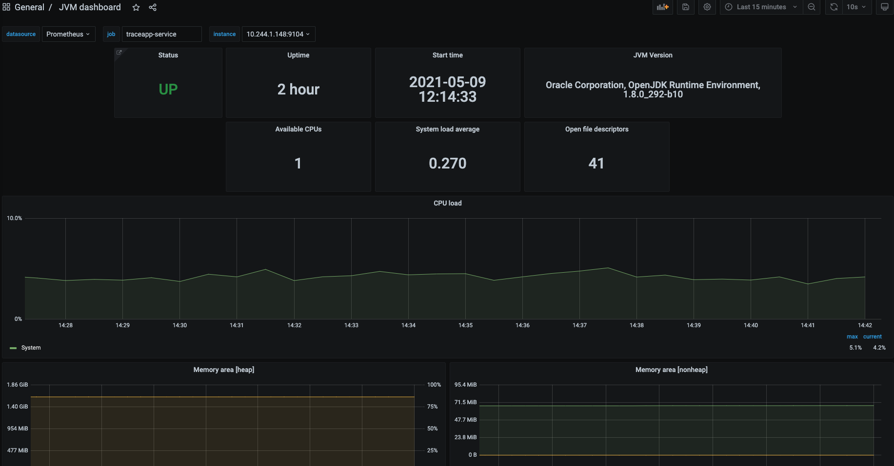

## Installation of Prometheus, Alertmanager & Grafana

- Use the Helm charts as below -

    ```
    helm repo add prometheus-community https://prometheus-community.github.io/helm-charts
    helm repo update
    helm install monitoring prometheus-community/kube-prometheus-stack
    ```

- Check the status of the installation

    ```
    k --namespace default get all -l "release=monitoring"
    k get prometheus
    NAME                                    VERSION   REPLICAS   AGE
    monitoring-kube-prometheus-prometheus   v2.26.0   1          15m
    ```

- Access the Prometheus UI

    ```
    k port-forward service/monitoring-kube-prometheus-prometheus 9090:9090
    ```

- Get the Grafana admin username & password

    ```
    k get secret  monitoring-grafana -o jsonpath="{.data.admin-user}" | base64 --decode ; echo
    k get secret monitoring-grafana -o jsonpath="{.data.admin-password}" | base64 --decode ; echo
    ```

- Access the Grafana UI
    ```
    k port-forward svc/monitoring-grafana 3000:80
    ```

- Import the JVM Dashboard for Grafana

    [ JVM Grafana Dashbord for Tracing app](./JVM-Dashboard.json)

    