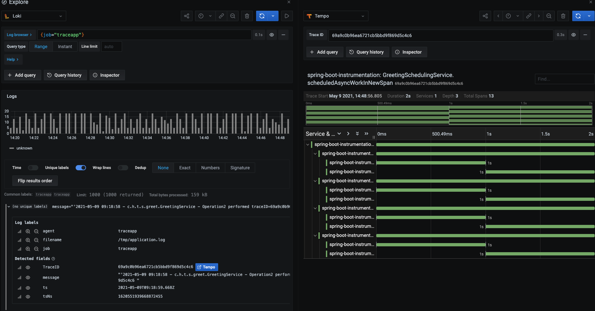

## Installation of Tempo

- Use the grafana helm charts

    ```
    git clone https://github.com/grafana/helm-charts.git
    cd charts
    ```

    Update the tempo/values.yaml
    ```
    otlp:
      protocols:
        grpc:
          endpoint: 0.0.0.0:55680
    ```

    Update `tempo/templates/configmap-tempo.yaml`
    ```
    querier:
      frontend_worker:
        frontend_address: 0.0.0.0:9095
    ```

    ```
    helm install  tempo -f ./tempo/values.yaml ./tempo
    ```

   
<br />
<hr /> <br />

